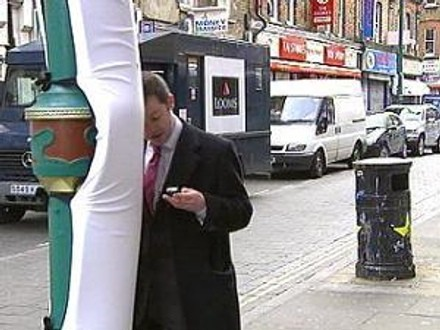
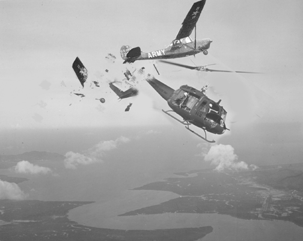
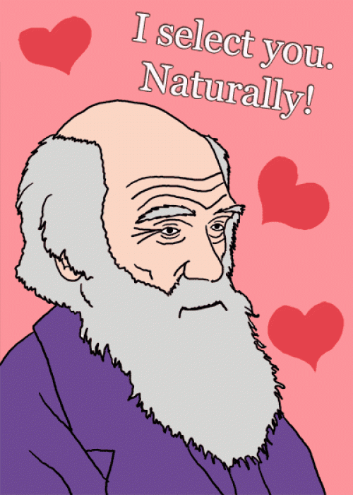
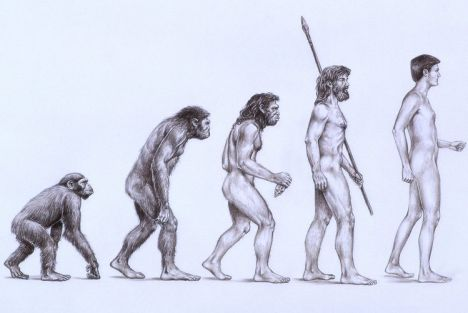

!SLIDE center
# Batman #

!SLIDE center

.notes or if you don't like code, "us humans are pretty cool I guess"

# The Nature of Code #
aka
## Us humans are pretty cool I guess ##

!SLIDE center

.notes * I say I guess because of things like this: 
  * photo is from a 2008 article in Engadget
  * walking-while texting injuries were getting out of hand
  * we aren't really that smart

  

source: [Engadget: Padded lampposts for distracted texters being tested in London](http://www.engadget.com/2008/03/06/padded-lampposts-for-distracted-texters-being-tested-in-london/)

!SLIDE center

.notes Things get worse when we move into three dimensions
 * air traffic controllers are widely cited as having the hardest jobs in the world
 * and stuff like this seems unavoidable
 * we try to solve these problems, and often we end up looking towards nature for a solution
 * for the example of a squadron of planes, how do we make them not collide?
 * how do birds avoid it?

source: [http://www.hack1966.com/images/MidAirPC.gif](http://www.hack1966.com/images/MidAirPC.gif)

!SLIDE center

.notes They exhibit a behaviour we have called flocking. They act as a flock. 
# Flocking #

!SLIDE center transition=fade
.notes Birds, which are practically insects with wings, manage to not hit each other, and still move in packs of many thousands, many hundred of thousands

!SLIDE bullets incremental

.notes They aren't smart, and we claim to be, so how do they do it?
 * Each bird follows a super simple set of rules
 * The rules, when "integrated" across the set of all the birds, make the set exhibit collective intelligence
 * the rules "simulate" a smarter animal on the big scale

# Flocking Behaviour

 * __Cohesion__: Try to get and stay close to nearby flock members
 * __Alignment__: Try to go in the same direction as nearby flock members
 * __Separation__: Don't get too close to the closest flock members

!SLIDE flocking center

.notes This is a live simulation of these little triangles following the 3 rules 
 * You can see they've immediately formed a flock, grouping together into clumps, this is the cohesion at work
 * you can see they are all going in the same direction, they aren't all flying towards the same point, they are just travelling, this is the alignment
 * and you can see they rarely run into each other, this is the separation. 
 * When one flock runs into another, the others move over just a bit, and this wave of pushing propagates through the flock. 
 * this is the exhibition of the collective intelligence

!SLIDE center 
# Model Us as a flock

.notes This stuff is really cool because these simple rules turn out to be totally generalizable. 
 * same algorithms have been used in piloiting automated drones and prove to be useful for accomplishing missions
 * coolest I've found is modeling humans as a flock, and predicting our opinions in the future by seeing us as flock members
 * you can sort of see how it might work, we don't want to be crazy fringe nutcases so we try to have similar opinions as the rest of our friends
 * but we want to remain unique so we stay just a little away from everyone else so we dont get accused of being copy cats or what have you

source: [gamasutra: Modeling Opinion Flow in Humans](http://www.gamasutra.com/view/feature/1815/modeling_opinion_flow_in_humans_.php)

!SLIDE center small

.notes Thats all I've got on flocking, lets move on to something else.
 * Let's talk about this guy, Darwin.
 * If you ask me, we are the most complex things nature has managed to come up with.

source: [http://joeydevilla.com](http://joeydevilla.com)

!SLIDE 

.notes humans are really neat, all of these intricate systems work in concert to do some pretty amazing stuff, and they all arose from nature
# We're pretty freaking cool

!SLIDE center

.notes this is a testament to the process that we're pretty sure came up with us
 * it took an absurdly long time, but don't you think that its impressive that we arose out of little squiggly things in some nasty smelling pool of nasty a while back?

source: [typepad](http://ablebrains.typepad.com/.a/6a00d8341ca86d53ef0133f1a5f4f5970b-800wi)

!SLIDE center

.notes anyways, turns out that this process is a great optimisation algorithm
 * i apologize to anyone in the room who has seen or worked with this stuff before, i dont want to bore you so ill make it quick
 * in essence
# Turns out we can emulate this process algorithmically as well

!SLIDE center

.notes if we generate a bunch of random strings of "DNA", call them a chromosome, 
 * and we have some way to measure how fit (in the Darwinian sense of the word) a chromosome is (in other words how sexy and smart it will grow up to be)
 * we can decide if its "good" or not, mutate it, breed it, and test its children, applying the same rules as natural evolution
 * survival of the fittest

# We can evolve shit.

!SLIDE bullets incremental

# Genetic Algorithms

.notes So this is the gist of a genetic algorithm
 * explain bullets
 * the coolest application of genetic algorithm's ive seen is in circuit design
 * sounds boring, I hate circuits, but its really cool.
 * this guy named Thompson set out to create a simple circuit a few years ago that had a microphone in it.
 * when he said stop to the circuit he wanted it to light up a red light
 * and when he said go to the circuit he wanted it to light up a green light
 * not outrageous demands for a circuit, a human could create a circuit that did this with a few days work and not very many expensive components
 * thompson, instead used a genetic algorithm

* take a bunch of individuals
* measure how good looking and smart they are
* take the best ones, leave them in a room with the lights off
* repeat with their children

!SLIDE center

.notes thomspon said "ok evolution, here's the basic primitive components you have to work with, do what you can to make me this circuit"
 * it was as if he put arms, legs, eyeballs, and what have you into a big pot and let whatever monstrosities that came out into the world to see if they survived
 * very, very quickly, so even if only one combination worked out of a million he would find it in a few days.

> Thompson realised that he could use a standard genetic algorithm to
> evolve a configuration program for an FPGA and then test each new
> circuit design immediately on the chip. He set the system a task that
> appeared impossible for a human designer. [...] Evolution had to come 
> up with a circuit that could discriminate between two tones...

source: [cache of www.netscrap.com](http://webcache.googleusercontent.com/search?q=cache:R55I_SBjuasJ:www.netscrap.com/netscrap_detail.cfm%3Fscrap_id%3D73+evolve+circuit+light+microphone+%22how+it+works%22&cd=1&hl=en&ct=clnk&gl=ca&source=www.google.ca)

!SLIDE center

.notes The most interesting part of this experiment was that Thomas didn't include the "clock" component to the circuit
 * clocks are what allow us as humans to make sense of circuit design, and ensure that things happen when they need to, they act as the traffic lights in the trafficking of electricity
 * he didn't give this piece to the primordial soup because he didn't want to skew the evolution process
 * putting in a designed piece may lead the algorithm to a solution which works but it would be using the same kind of thinking we would have used to get there
 * humans invented this clock component, so why not see if evolution invents it too

# "Evolution has been free to explore the full repertoire of behaviours available from the silicon resources"

!SLIDE center

.notes So he let it run. 
 * it worked, it took 4100 generations, but it worked
 * he looked at it, no clock had evolved
 * and most interestingly, this is a direct quote

&nbsp;

!SLIDE center transition=fade

.notes Thompson had no idea how the circuit that evolved actually functioned.

# "But really, I don't have the faintest idea how it works"

!SLIDE center

.notes Out of 100 possible spots for components, the evolved circuit only used 32
 * The coolest part of this whole thing was there there were 5 cells that weren't connected
 * they were a closed loop in circuit parlance, it was two separate systems isolated from one another
 * yet if he disconnected them, the whole thing stopped working.

> It transpired that only 32 *[of 100]* were essential to the
> circuit's operation. Thompson could bypass the other cells without
> affecting it. __A further five cells appeared to serve no logical
> purpose at all__--there was no route of connections by which they could
> influence the output. And yet __if he disconnected them, the circuit
> stopped working__.

!SLIDE center

.notes The circuit made use of the subtle but inherent qualities in the components it was made of
 * when a human designer makes a circuit, they use components with a specified tolerance or range or whatever
 * they strive to find pieces that act consistently, and the more consistent a component is the more it costs
 * then they plug all these into a circuit and hope that it's output matches what the circuit did on paper with ideal components
 * instead, evolution designed a far, far more efficient circuit, using the inherently flawed properties of the components its working with
 * it had no design bias like us, it doesn't care about an individual components tolerance
 * it just has to work in concert and very precisely with the rest of the components
 * so, expect to see circuits evolved by us that we dont understand in electronics in the coming years, because they are cheaper and better designed

> It appears that evolution made use of some physical property of these
> cells--possibly a capacitive effect or electromagnetic inductance--to
> influence a signal passing nearby.  Somehow, it seized on this subtle
> effect and incorporated it into the solution.

!SLIDE center

# Thanks for a (almost done) superb summer!
